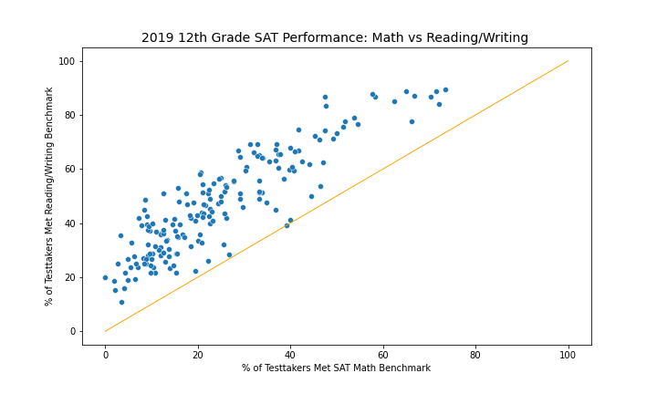
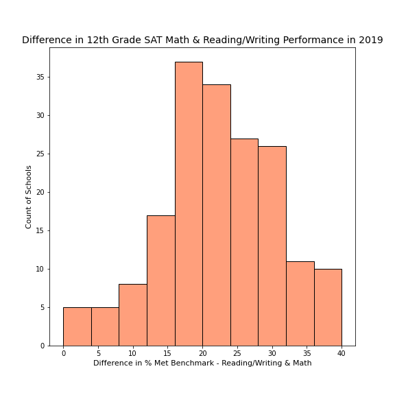
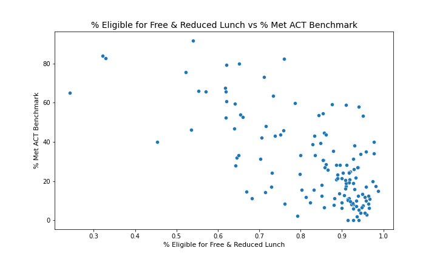
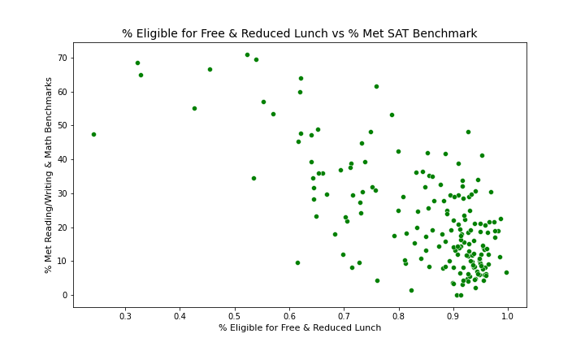
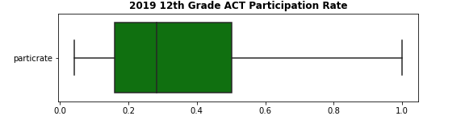
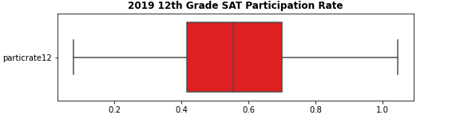

# **Project 1: Standardized Test Analysis**
## **DSI 1010 - Debbie Sim**
---

## Repo Folder Organization
|Folder|Type|Description|
|---|---|---|
|cleaned_data|folder|contains the final cleaned datasets used for analysis|
|code|folder|contains jupyter lap notebook with data cleaning, data analysis, and data visualization outputs|
|data|folder|contains raw datasets| 
|plots|folder|exported graphs from jupyter lab as png files| 
|README-DebbieSim-Project1.md|README|Debbie created README file for project 1|
|README.md|README|Original unedited README file for project 1|
|GADSI1010_DebbieSim_Project1.pdf|pdf|pdf of presentation slides|

## Problem Statement

Los Angeles Unified School District recently signed a contract with an external organization providing coaching to improve student college and career readiness for a select group of schools with a focus on reading/writing and math content areas. As a contractor, I am tasked with analyzing ACT/SAT standardized test performance data for 12th graders from previous school years (2019) to identify trends to assist LAUSD and the external organization in narrowing down their focus. Should coaches focus on one or both content areas and should school socioeconomic status be a factor in school selection?

## Data Dictionary

### *Dataset 1: LAUSD_act2019_final.csv*
|Feature|Type|Dataset|Description|
|---|---|---|---|
|year|object|LAUSD_act2019_final|The academic year corresponding to dataset| 
|cds|float|LAUSD_act2019_final|A unique 14-digit code corresponding to the school within California composed of county code, district code, and school code |
|ccode|float|LAUSD_act2019_final|A 2-digit code corresponding to county| 
|cdcode|float|LAUSD_act2019_final|A 5-digit code corresponding to school district| 
|scode|float|LAUSD_act2019_final|A 7-digit code corresponding to the school| 
|rtype|object|LAUSD_act2019_final|record type indicates whether the row of data corresponds to school, district, or state (S=School Record D=District/LEA Record X=State Record)| 
|dname|object|LAUSD_act2019_final|district name| 
|cname|object|LAUSD_act2019_final|county name| 
|sname|object|LAUSD_act2019_final|school name| 
|charter_school_(y/n)|object|LAUSD_act2019_final|Indicates whether or not the school identifies as a charter school| 
|percent (%)_eligible frpm_(k-12)|float|LAUSD_act2019_final|The percent of students eligible for free or reduced price meals (FRPM)| 
|enroll12|float|LAUSD_act2019_final|Total count of 12th grade students| 
|numtsttakr|float|LAUSD_act2019_final|Total number of 12th grade students that took the ACT| 
|avgscrread|float|LAUSD_act2019_final|Average ACT reading score for students who took the ACT| 
|avgscreng|float|LAUSD_act2019_final|Average ACT english score for students who took the ACT| 
|avgscrmth|float|LAUSD_act2019_final|Average ACT math score for students who took the ACT| 
|avgscrsci|float|LAUSD_act2019_final|Average ACT science score for students who took the ACT | 
|numge21|float|LAUSD_act2019_final|The number of ACT testtakers that met the ACT benchmark score of 21|
|pctge21|ifloat|LAUSD_act2019_final|The percent of ACT testtakers that met the ACT benchmark score of 21|

### *Dataset 2: LAUSD_sat2019_final.csv*
|Feature|Type|Dataset|Description|
|---|---|---|---|
|year|object|LAUSD_sat2019_final|The academic year corresponding to dataset| 
|cds|float|LAUSD_sat2019_final|A unique 14-digit code corresponding to the school within California composed of county code, district code, and school code |
|ccode|float|LAUSD_sat2019_final|A 2-digit code corresponding to county| 
|cdcode|float|LAUSD_sat2019_final|A 5-digit code corresponding to school district| 
|scode|float|LAUSD_sat2019_final|A 7-digit code corresponding to the school| 
|rtype|object|LAUSD_sat2019_final|record type indicates whether the row of data corresponds to school, district, or state (S=School Record D=District/LEA Record X=State Record)|
|sname|object|LAUSD_sat2019_final|school name| 
|dname|object|LAUSD_sat2019_final|district name| 
|cname|object|LAUSD_sat2019_final|county name|  
|charter_school_(y/n)|object|LAUSD_sat2019_final|Indicates whether or not the school identifies as a charter school| 
|percent (%)_eligible frpm_(k-12)|float|LAUSD_sat2019_final|The percent of students eligible for free or reduced price meals (FRPM)| 
|enroll12|float|LAUSD_sat2019_final|Total count of 12th grade students| 
|numtsttakr12|float|LAUSD_sat2019_final|Total count of 12th grade students that took the SAT|
|numerwbenchmark12|float|LAUSD_sat2019_final|Total count of 12th grade testtakers that met the reading and writing benchmark|
|pcterwbenchmark12|float|LAUSD_sat2019_final|Percent of 12th grade testtakers that met the reading and writing benchmark|
|nummathbenchmark12|float|LAUSD_sat2019_final|Total count of 12th grade testtakers that met the math benchmark|
|pctmathbenchmark12|float|LAUSD_sat2019_final|Percent of 12th grade testtakers that met the math benchmark|
|totnumbothbenchmark12|float|LAUSD_sat2019_final|Total count of 12th grade testtakers that met both reading/writing and math benchmark|
|pctbothbenchmark12|float|LAUSD_sat2019_final|Percent of 12th grade testtakers that met both reading/writing and math benchmark|

## Summary of Analysis

* #### Overall, schools had stronger performance on the reading and writing portion of the SAT than math.
    * When looking at the SAT data specifically, because the dataset was broken down by math vs reading/writing, I was able to uncover that overall, most schools had a higher percentage of students meeting the reading and writing portion of the SAT than math
    * The orange line represents equal percentage of students meeting reading and math benchmarks
    * Other than the 2-3 schools on the orange line, you can see below that all of the other schools are above the line indicating that more students were meeting the reading/writing benchmark than math

* #### Gaps in reading/writing and math performance is concentrated in the 16-32 % difference range.
    * The graph below shows that difference in reading and math performance at a school-level is concentrated in the 16-32% difference range
    * For example, about 36 schools saw a 16-20% gap in the % of students meeting reading vs math benchmarks
    * This continues to show the need for support around math content knowledge across the district

* #### Schools with higher rates of students who qualify for free and reduced lunch correlate with lower ACT and SAT performance.
    * A lot of times, if we just look at academic performance, it can fail to tell the whole story about schools and the students
    * Looking at the % of free and reduced lunch as a metric for socio-economic status, you can see that as the % of free & reduced lunch goes up in a school, the % of students meeting ACT and SAT benchmarks trend downward
 

* #### Student participation low for the ACT. 75% of schools where ACT testing was available for 12th graders had lower than 50% participation.
    * Student participation is low in general across the country (). In LAUSD, it's particular low for the ACT. 75% of schools where ACT testing was available for 12th graders, lower than half of the students took the ACT.
    * It's important to recognize that student participation in either assessment is not required, cost could be a barrier to participation, and with changes to test score requirements at higher institutions, it may actually make more sense for students to opt-out
  

## Conclusions & Recommendations

1. External partner should focus coaching mainly on improving math content knowledge. It's evident that students are struggling to meet math ACT/SAT benchmarks. 
2. % of students eligible for free & reduced lunch is a metric worth considering in narrowing down the list of schools to support through the partnership. This isn't the only metric, but could be looked at in addition to other potential metrics such as % of students that are enrolled in AP courses, school location trends, and % of ELL (As of 2021, 26% of the district identify as ELL ([*source*](https://achieve.lausd.net/cms/lib/CA01000043/Centricity/Domain/1371/22-26_Strategic_Plan.pdf))). These are other metrics the district should explore.
3. ACT/SAT may no longer be the best assessment to measure college & career readiness. District could utilize middle school results from the Smarter Balanced state assessments.
    * As of 2022, ACT/SAT no longer administered by the CA Department of Education ([*source*](https://www.cde.ca.gov/re/pr/satdata.asp)).
    * Many institutions no longer require ACT/SAT as prerequisites to application ([*source*](https://fairtest.org/test-optional-list/)).
    * Student performance on formative assessments in middle school or 9th grade may be early indicators of college and career readiness and may aid the district in early intervention as well.